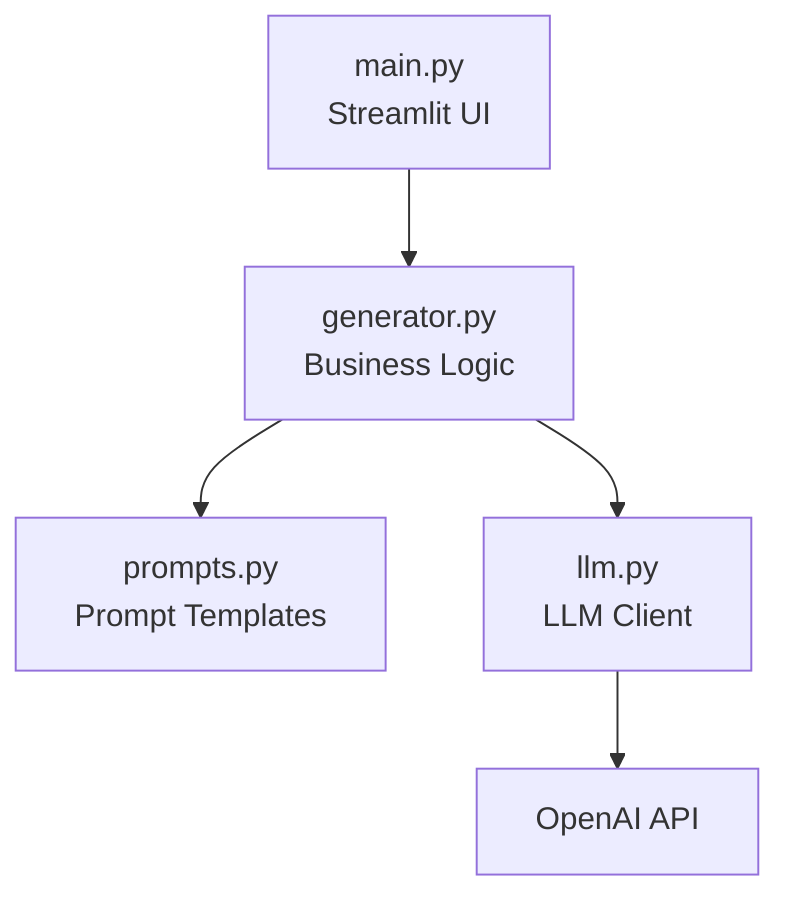

# 🧠 Prompt Refiner

[]


A Streamlit app that rewrites rough prompts into clear, structured, and
effective instructions for large language models.

## 🚀 Overview

Prompt Refiner helps users improve the quality of their AI prompts by
rewriting them to be clearer, more specific, and better structured — while
preserving the original intent.

This app is useful for developers, content creators, and anyone working with
large language models.

## 🧱 Architecture

The app follows a clean, layered architecture that separates UI, business
logic, and LLM integration.



## ✨ Features

-   Side-by-side comparison of original and refined prompts
-   Tone selection (professional, concise, creative, etc.)
-   One-click copy of refined prompts
-   Secure OpenAI API key handling
-   Clean, modular code structure

## 🏃 Run Locally

### Prerequisites

-   Python 3.11
-   Poetry

### Setup

```bash
git clone https://github.com/Emmatshi/my-bc-st005.git
cd my-bc-st005
poetry install

```

## 🧩 Built With

This app was built using a reusable Streamlit AI template designed to
standardize architecture, secrets handling, and deployment.
